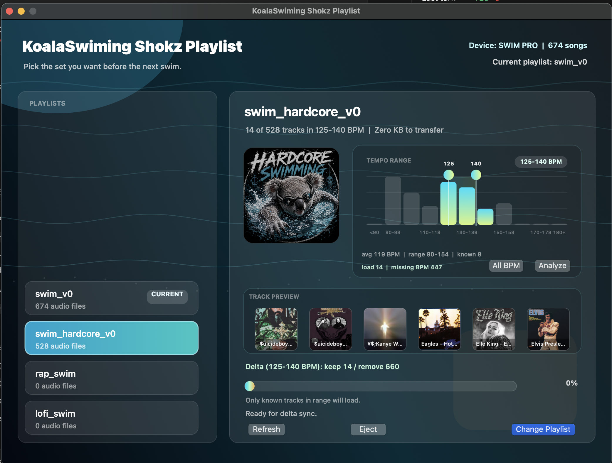

# KoalaSwiming Shokz Playlist

What happen when a lazy vibe coder starting to swim? A lazy pepole app to swim with music!
KoalaSwiming Shokz Playlist is a small native macOS app for managing music on Shokz swim headphones that behave like a simple USB music player. Instead of manually deleting and copying MP3s, you keep playlist folders on your Mac and choose which one to sync when the headphones are connected.



## What It Does

- Shows a polished chooser when your Shokz drive is connected.
- Detects the current headphone playlist by comparing filenames.
- Syncs by delta: keeps matching tracks, removes old tracks, and copies only missing or changed files.
- Shows transfer progress with ETA, copied bytes, current operation, and pause support.
- Lets you safely eject the headphones from the app.
- Displays playlist covers from `playlist_images/`.
- Shows embedded album art in the track preview when MP3 files include it.
- Calculates and caches BPM so you can sync only songs inside a chosen tempo range.
- Can install a LaunchAgent so the app opens automatically when `SWIM PRO` mounts.

## Quick Start

1. Clone or download this repository.
2. Put audio files into folders inside `playlists/`.
3. Connect your Shokz headphones so they appear in Finder as a mounted drive.
4. Double-click `Sync Swim Playlist.command`.
5. Choose a playlist and click `Change Playlist`.
6. Click `Eject` when the sync is done.

Example folder layout:

```text
playlists/
  rap_swim/
    song-one.mp3
    song-two.mp3
  lofi_swim/
    calm-track.mp3
```

Supported audio extensions:

```text
mp3, m4a, wav, flac, aac, wma
```

## Guide

### 1. Create Playlist Folders

Each folder inside `playlists/` becomes a selectable playlist in the app. The folder name is the playlist name shown in the UI.

```text
playlists/swim_hardcore/
playlists/rap_swim/
playlists/lofi_swim/
```

The app does not store playlist metadata on the headphones. It simply makes the headphone drive match the selected folder.

### 2. Add Optional Playlist Images

Playlist images live in `playlist_images/`. Use the exact playlist folder name with one of these extensions:

```text
jpg, jpeg, png, heic, tiff, webp
```

Example:

```text
playlists/rap_swim/
playlist_images/rap_swim.jpg
```

If no playlist image exists, the app generates a simple fallback cover.

### 3. Sync A Playlist

When you click `Change Playlist`, the app builds a sync plan:

- Same filename and same file size: kept on the headphones.
- Same filename but different size: refreshed.
- Missing from headphones: copied.
- On headphones but not in the selected playlist: removed.
- macOS `._` metadata files: cleaned.

New or changed tracks are copied through a temporary file first, then moved into place when complete. If you pause or something fails, the app avoids leaving broken half-copied tracks behind.

### 4. Pause Or Eject

During a transfer, click `Pause` to stop at a safe point. Anything already completed stays on the headphones.

After a successful sync or pause, click `Eject` to safely eject the Shokz drive.

### 5. Analyze BPM

Click `Analyze` on a playlist to calculate BPM values. The app uses:

- Existing MP3 BPM tags when available, especially `TBPM`.
- Cached BPM values when the file has not changed.
- Audio-based BPM estimation when metadata is missing.

Results are saved in:

```text
playlist_analysis/bpm_cache.json
```

The cache is local and ignored by git because it depends on your personal music files.

### 6. Sync By Tempo Range

After BPM values exist, drag the handles in the tempo chart to choose a min/max BPM range. When a range is active, the app syncs only tracks with a known BPM inside that range.

If the selected range shows fewer tracks than expected, click `Analyze` first so more tracks have BPM data.

Click `All BPM` to reset the filter and sync the whole playlist again.

## Auto Prompt On Device Connect

To make the chooser open automatically when a drive is connected:

```sh
./scripts/install_auto_prompt.sh
```

To install it and open the GUI immediately:

```sh
./scripts/install_auto_prompt.sh --open-now
```

The installer builds:

```text
~/Applications/KoalaSwiming Shokz Playlist.app
```

It also registers a LaunchAgent that watches `/Volumes` and opens the app when the configured Shokz drive appears.

To remove the auto prompt:

```sh
./scripts/uninstall_auto_prompt.sh
```

## Configuration

The default mounted device name is `SWIM PRO`. To use another volume name:

```sh
SWIM_DEVICE_NAME="Your Volume Name" ./scripts/swim_playlist_gui.sh
```

To use a different playlist folder:

```sh
SWIM_PLAYLISTS_DIR="/path/to/playlists" ./scripts/swim_playlist_gui.sh
```

If you want the auto prompt to use a different device name permanently, edit `SWIM PRO` in `scripts/install_auto_prompt.sh`, then rerun the installer.

## Repository Notes

This repo intentionally ignores real audio files in `playlists/`, local BPM cache files, logs, and local playlist images. Keep your music library on your own machine; commit only the app, scripts, docs, icon, and placeholder folders.
